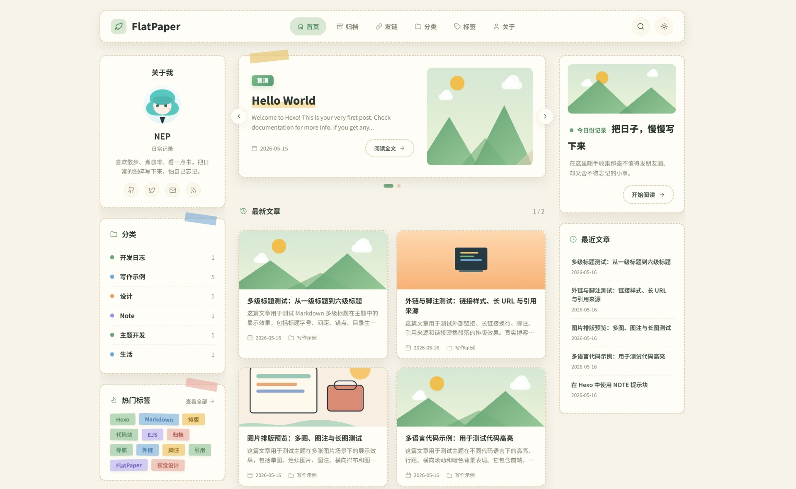
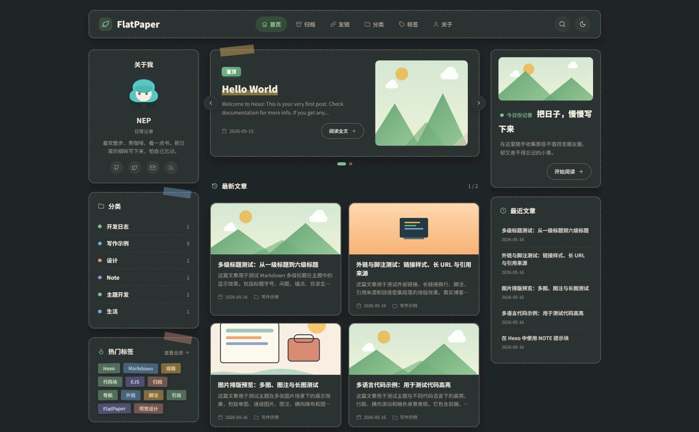

# FlatPaper

A Hexo theme inspired by flat illustrations and paper cards — dashed outlines, sticky notes, tape strips, and a soft, low-contrast reading interface. Built on modular Stylus partials and a small EJS template layer, with no runtime dependencies.

- **[Live demo](https://flatpaper.nep.me/)**.
- **[Author's blog](https://homulilly.com/)**

## Document

Documentation is available in multiple languages:

- **中文** — [README_zh.md](README_zh.md)

## Live Preview

| Light mode | Dark mode |
| --- | --- |
|  |  |

## Installation

```bash
# inside your Hexo site
git clone https://github.com/Homulilly/hexo-theme-flatpaper.git themes/flatpaper
# or copy this folder directly

# enable it in <site>/_config.yml
theme: flatpaper

# copy and edit the theme config
cp themes/flatpaper/_config.yml _config.flatpaper.yml

hexo g && hexo s
```

Open <http://localhost:4000>.

Recommended pagination settings in the **site** `_config.yml`:

```yaml
index_generator:
  per_page: 10
  order_by: -date

per_page: 10
```

To enable an RSS feed:

```bash
pnpm add hexo-generator-feed
```

```yaml
# site _config.yml
feed:
  enable: true
  type: atom
  path: atom.xml
  limit: 20
  content: true
```

## Configuration

All options live in `themes/flatpaper/_config.yml`. Copy it to `<site>/_config.flatpaper.yml` before editing.

> The site name (brand text in the header) and `<meta name="description">` are read directly from the Hexo site `_config.yml` (`title` and `description`); the theme no longer duplicates them.

```yaml
menu:
  Home:
    link: /
    icon: home
  Archives:
    link: /archives/
    icon: archive
  # Links:
  #   link: /links/
  #   icon: link
  # Nested menu example:
  # Site:
  #   icon: folder
  #   item:
  #     Categories:
  #       link: /categories/
  #       icon: folder
  #     Tags:
  #       link: /tags/
  #       icon: tag
  #     About:
  #       link: /about/
  #       icon: user

profile:
  role: Daily notes
  bio: Introduce yourself in one or two memorable sentences.
  avatar:                             # image path under site source/; empty uses the CSS-drawn default avatar
  avatar_shape: square                # square or circle
  site_info:                          # empty / false hides; true shows plain text; other non-empty values become links
    # posts: /archives/
    # categories: /categories/
    # tags: /tags/
  social:
    # Built-in icon keys: github, twitter, x, mail/email, rss, steam, bilibili,
    # youtube, facebook, instagram, telegram, weibo
    # GitHub: https://github.com/yourname
    # X: https://x.com/yourname
    # Email: mailto:you@example.com
    # Mastodon:
    #   url: https://mastodon.social/@yourname
    #   icon: send
    # Zhihu:
    #   url: https://www.zhihu.com/people/yourname
    #   svg: '<path d="M2 2 L22 22"/>'
  rss:
    enable: true
    path: /atom.xml

welcome:
  label: Today's note
  title: Write the days down slowly
  text: Life is not spectacular every day, but there are always moments worth keeping.
  cta_text: Start reading
  cta_link: archives/
  # image: /images/welcome.jpg        # optional 16:9 cover image; empty keeps the CSS mountain scene

excerpt_length: 96
recent_posts: 6                       # random sidebar post count; candidates are the latest 100 posts at generate time
related_posts: 4                      # 0 disables related posts

search:
  limit: 0                            # 0 or empty means unlimited

tags:
  style: tape                         # tape | pill

featured:
  # - hello-world
  # - markdown-elements-showcase
featured_autoplay: 5000               # milliseconds; 0 disables autoplay
featured_image_zigzag: true

color: green                          # green | pink | blue | orange | sakura

tape:
  enable: true

footer:
  left: '© {year} By {name}'          # placeholders: {year}, {name}, {theme}
  right: 'Powered by Theme {theme}'

note:
  style: flat                         # flat | simple | modern | disabled
  icons: true

code:
  theme: dark                         # dark | sand | light

umami:
  enable: false
  host:                               # e.g. analytics.example.com
  website_id:                         # e.g. xxxxxxxx-xxxx-xxxx-xxxx-xxxxxxxxxxxx
  # domains: example.com,www.example.com

adsense:
  enable: false
  client:                             # e.g. ca-pub-1234567890123456
  account: false
  slots:
    post_top:
    post_bottom:
    sidebar:

comments:                             # twikoo | artalk; empty disables comments

twikoo:
  envId:                              # e.g. https://twikoo.example.com
  # cdn:

artalk:
  server:                             # e.g. https://artalk.example.com
  site:
  # cdn_css:
  # cdn_js:

fancybox:
  enable: true
  # cdn_css:
  # cdn_js:

inject:
  head:
    # - <link rel="stylesheet" href="/css/custom.css" media="defer" onload="this.media='all'">
    # - <script src="/js/extra.js"></script>
  bottom:
    # - <script src="/js/extra.js" defer></script>
```

When Umami is enabled, the following snippet is injected right before `</head>`:

```html
<script defer src="https://<host>/script.js" data-website-id="<website_id>" data-domains="..."></script>
```

- `host` only accepts plain `domain` or `domain:port` values (e.g. `analytics.example.com`, `localhost:3000`). A leading `https://` is stripped automatically; anything containing other characters is rejected and no script is injected.
- `domains` is Umami's built-in **blog-domain allowlist**: the tracker only reports when the visiting page's `hostname` matches an entry. The field is optional; both a comma-separated string and a YAML list are accepted.

**Comments** are gated by the top-level `comments:` selector: set it to `twikoo` or `artalk` and the corresponding system activates (as long as its required field is filled — `envId` for Twikoo, `server` for Artalk). Leave it empty / remove the field and no comment UI renders. Comments appear **after the main content of post pages and standalone pages** (about / friends / etc. with `layout: page`); index pages (home, archives, categories, tags) never show them. Both systems require a self-hosted backend:

- Twikoo: see the [Twikoo quick start](https://twikoo.js.org/quick-start.html). Container id is `#tcomment`.
- Artalk: see the [Artalk deployment guide](https://artalk.js.org/guide/deploy.html). Container id is `#artalk-comments`, initialization goes through `Artalk.init({...})`. `pageKey` defaults to `page.permalink`, `pageTitle` to `page.title`, and `site` must match the site name registered in the Artalk admin.

### UI Options and Current Defaults

### Featured Carousel

- `featured` accepts post slugs, full permalink paths, the last path segment, or exact titles. Matching is case-insensitive.
- Set `featured_image_zigzag: false` to disable the zigzag edge on featured images.
- It renders only on **page 1** of the home pagination.
- 1 post renders as a single static card. 2-4 posts render as a carousel with arrows, dot indicators, keyboard arrow support, and autoplay that pauses on hover / focus.

### Cover Images

```yaml
---
title: Weekend Walk
date: 2026-05-16
cover: /images/walk.jpg               # or an absolute URL
---
```

Resolution order: `cover` -> `thumbnail` -> `image` -> `banner` -> the first inline `` in the rendered body. The first match wins. If none exist, the theme falls back to a CSS scene (sun + clouds + mountains / computer / camera).

Images use `object-fit: cover; object-position: 50% 50%`, so wide images keep the visible vertical centerline.

### Related Posts

Post pages automatically append a **standalone "Related Posts" card** below the article. Scoring:

- Each shared category +3
- Each shared tag +2
- Posts with a 0 score are excluded entirely; when no related posts exist, the card does not render
- When scores tie, newer posts win

Set `related_posts` (or fall back to `recent_posts`) to control how many cards are shown. Set `related_posts: 0` explicitly to disable the entire block (the card stops rendering).

### Search

Click the magnifier button in the header, or press **Ctrl + K / Cmd + K** anywhere. Press **Esc** to close. Results are filtered from an inline JSON index of all posts by default; set `search.limit` to cap it to the latest N posts. Keywords are highlighted with `<mark>`.

### Dark Mode

The circular toggle button in the header stores state in `localStorage['flatpaper-mode']`. The toggle reads the stored state before paint to avoid FOUC.

### Accent Color

Set `color: green`, `pink`, `sakura`, `blue`, or `orange` in the theme config to choose the default accent color. The palette button in the header opens the color menu and stores the selection in the `flatpaper-accent` cookie.

### Code Block Theme

`code.theme` accepts `dark`, `sand`, or `light`. `sand` is the cream / light code theme; `light` is the white code theme. The value is written to `<body data-code-theme="...">`, and a CSS scope covers all code blocks.

Per-block UI:

- macOS-style title bar with three colored dots
- Language badge on the left, auto-detected from the highlight.js class (for example `figure.highlight.js -> JavaScript`). `plain / plaintext / text / txt / none / raw` resolve to empty and hide the badge.
- Copy support
- Collapse support (chevron, rotates 180 degrees)

**Line-number interactions**:

- **Single-click a line number**: toggles a soft yellow highlight on that gutter row and the matching code row. Multiple rows can be highlighted independently; click the same row again to clear it.
- **Double-click a line number**: copies the matching code line's text to the clipboard and briefly flashes the gutter row green (~500ms).
- The full row width is the hit target — you don't have to click the digits precisely.

### Avatar and Welcome Card

- `profile.avatar`: an image path under the site `source/` (e.g. `/images/avatar.png`) or an absolute URL; leave it empty to use the CSS-drawn default avatar.
- `profile.avatar_shape`: `square` (default) renders the avatar with a 10px subtle rounding; `circle` applies a circular mask.
- `profile.site_info`: stats shown in the profile card. Empty values and `false` hide an item, `true` shows plain text, and any other non-empty value renders as that item's link.
- `profile.social`: social links shown in the profile card; keys auto-match built-in icons, object values can override the icon or provide inline SVG.
- `profile.rss`: appends an RSS icon to the profile social links row when `enable: true`.
- `welcome.image`: cover image for the welcome card; setting it switches the container to a 16:9 aspect ratio, flush with the card edge (`overflow: hidden` + 12px top corner radius). Leave empty to keep the default CSS mountain scene.

### Note Block Appearance

`note.style` ships four looks that mirror the equivalent NexT presets:

- **`flat`** (default): left accent strip + soft tinted background, rounded card.
- **`simple`**: left accent strip + 1px thin border, no background fill.
- **`modern`**: fully filled rounded box without the left accent strip, paired with a 1px inset border.
- **`disabled`**: strips all chrome but keeps the `<details>` foldable semantics; the body uses the site's regular prose styling.

`note.icons: true | false` controls whether the circular icon badge appears next to the body / title. With icons off, the body reclaims the icon column and aligns flush with the card padding.

### Custom Injection

`inject.head` / `inject.bottom` are arrays of HTML strings; each entry is emitted verbatim before `</head>` or `</body>`. You can inject:

- Custom CSS: `- <link rel="stylesheet" href="/css/custom.css">`
- Custom JS: `- <script src="/js/extra.js" defer></script>`
- Inline `<style>` / `<script>` blocks, third-party SDKs, or any other HTML fragment.

The contents are **not escaped** — they're spliced directly into the page, so only put trusted, self-authored values in there.

## Highlights

- **Adaptive layout**: three columns on home / list pages, two columns on post pages, single-column drawer mode on narrow screens.
- **Sticky TOC**: the post-page TOC card stays sticky across the full article range; home / list page sidebars scroll normally with the page.
- **Featured carousel**: pin up to four posts in `_config.yml`, with automatic rotation and hover-to-pause support.
- **Cover images**: resolves `cover` / `thumbnail` / `image` / `banner` / first inline ``; falls back to a CSS-drawn scene when no image exists.
- **Personalize profile / welcome card**: `profile.avatar_shape` toggles between `square` and `circle` masks; `welcome.image` swaps the CSS mountain scene for a custom 16:9 cover image.
- **macOS-style code blocks**: language badge (auto-detected), copy / collapse buttons, and `dark` / `sand` / `light` themes. Single-click a line number to highlight that line; double-click to copy it.
- **Hexo NexT-compatible tags**: `` (6 colors × 4 visual styles `flat / simple / modern / disabled`, foldable) and `` (with collapsible mode); also accepts the VitePress-style `::: type [title] ... :::` container syntax.
- **Pages routed by `type:`**: set `type: link | tags | categories` in front-matter to route to a custom layout.
- **Friends page**: grouped cards, avatar fallback, per-link RSS badges, and a hover signal-pulse animation.
- **In-page search**: global Ctrl+K / Cmd+K popup backed by an inline JSON index of all posts.
- **Optional comment system**: top-level `comments: twikoo | artalk` selects Twikoo or Artalk; any page can opt out via front-matter `comments: false`.
- **Dark mode**: single-class toggle, persisted to `localStorage`; every component has a dark variant.

## Custom Tags

### ``

```

  A success note



  When a title is provided, the note renders as a foldable <details>.

```

Supported types: `default`, `primary`, `success`, `info`, `warning`, `danger`. Adding a title turns the note into a foldable disclosure (native `<details>`, no JS needed).

You can also use the VitePress-style container syntax, which is **fully equivalent** to the tag above:

```
::: success
A success note
:::

::: warning Notice
When a title is provided, the note renders as a foldable <details>.
:::
```

The `:::` rewrite happens at `before_post_render`, and any `:::` inside fenced (``` / ~~~) or 4-space-indented code is preserved verbatim. Both syntaxes can be mixed freely within a single post.

### ``

```

<!-- tab -->
**Tab 1**
<!-- endtab -->
<!-- tab Custom name -->
Content...
<!-- endtab -->

```

- First argument: base name used when an individual tab does not provide one (`Tab 1`, `Tab 2`, ...).
- Second argument: 1-based default tab index. Use **`-1`** for collapsed mode: all tabs start closed, click to expand, and click again to collapse.

## Special Pages

Front-matter `type:` routes `source/<dir>/index.md` to a custom layout (the original `layout:` still works as a fallback):

```yaml
---
title: Links
type: links            # or: tags, categories
---
```

Recognized values: `links`, `tags`, `categories`. Anything else / missing value -> default page layout.

### Friends Page (`type: links`)

Data lives in `source/_data/links.yml`. Multiple groups are supported:

```yaml
- class_name: DEMO
  class_desc: Example links to common development and documentation sites, used to test friend-link card rendering.
  flink_style: demo
  link_list:
    - name: GitHub
      link: https://github.com/
      avatar: https://github.githubassets.com/favicons/favicon.svg
      descr: Code hosting and collaboration platform for developers.
      rss:  # optional, shows an RSS badge on the card
```

Cards include: avatar (first-letter fallback when missing) + name + description. RSS badges are always visible, and play a "signal-pulse" animation on hover (icon wiggle + outward ring). The markdown body below the front-matter renders normally and is separated with a dashed rule.

## Layout

| Layout         | File                           | Purpose                                          |
| -------------- | ------------------------------ | ------------------------------------------------ |
| Home           | `layout/index.ejs`             | Featured carousel + paginated post grid          |
| Post           | `layout/post.ejs`              | Two-column article + reactions + previous / next + related posts card |
| Page           | `layout/page.ejs`              | Default page; routes to a custom layout by `type:` |
| Friends        | `layout/link.ejs`              | Friends grid + optional markdown body            |
| Archive        | `layout/archive.ejs`           | Date-grouped post list + pagination              |
| Category index | `layout/categories.ejs`        | Tag-cloud-like compact grid                      |
| Category       | `layout/category.ejs`          | Posts under one category + pagination            |
| Tag index      | `layout/tags.ejs`              | Tag cloud                                        |
| Tag            | `layout/tag.ejs`               | Posts under one tag + pagination                 |

Shared partials in `layout/_partial/`:

- `head.ejs`: meta + stylesheet
- `header.ejs`: brand, navigation, search, theme toggle, drawer toggle (narrow screens only)
- `footer.ejs`: configurable footer with `{year}` / `{name}` / `{theme}` template tokens; `{theme}` renders as a link to the theme repo
- `sidebar-left.ejs` / `sidebar-right.ejs`: see the sidebar layout note below
- `random-posts.ejs`: reusable random-posts card, backed by the latest 100 posts at generate time
- `post-card.ejs`: home / grid card with edge-bleed thumbnail
- `archive-list.ejs`: paginated archive / category / tag list
- `thumbnail.ejs`: real cover image and CSS-scene fallback
- `search.ejs`: popup dialog + inline JSON index
- `icons.ejs`: Lucide icon lookup

### Sidebar Layout Note

In the DOM, the visual **left** column is rendered by `sidebar-right.ejs` (profile, post page TOC, home categories / tags), while the visual **right** column comes from `sidebar-left.ejs` (home welcome card, random posts). This order makes the more useful "left" panel become the hamburger-controlled drawer on narrow screens.

Post pages skip `sidebar-left` entirely and keep only one sidebar.

## Development

```
themes/flatpaper/
|-- _config.yml
|-- layout/
|   |-- _partial/                    # head, header, footer, sidebars, search, icons, etc.
|   `-- *.ejs                        # one file per top-level layout
|-- scripts/
|   |-- tags.js                      # Hexo extension:  + 
|   |-- note-container.js            # before_post_render: ::: container -> 
|   `-- _note-types.js               # shared note-type whitelist (tags.js / note-container.js)
`-- source/
    |-- css/
    |   |-- style.styl               # main entry: organizes partials by @import order
    |   `-- _partials/
    |       |-- var.styl             # CSS custom properties (tokens)
    |       |-- base.styl            # reset, html / body, page-grain
    |       |-- _layout/             # header, shell, tape, footer, responsive
    |       |-- _global/             # section-head, thumbnail, pager
    |       |-- _components/         # welcome, toc, featured, post-card, etc.
    |       |-- _page/               # article, archive-taxonomy
    |       `-- _mode/               # code-dark, code-sand, code-light
    `-- js/main.js                   # single bundle: theme toggle, search, anchors,
                                     #   TOC scrollspy (with bottom-lock), carousel,
                                     #   sidebar drawer, code block UI, tabs
```

## License

MIT
